# Journal

## 2025-07-12

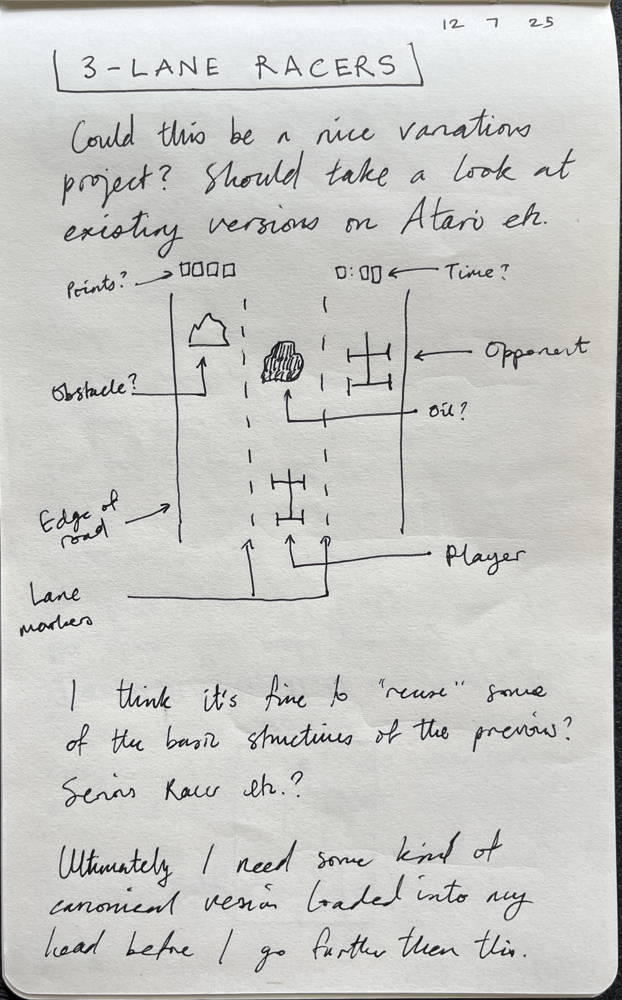

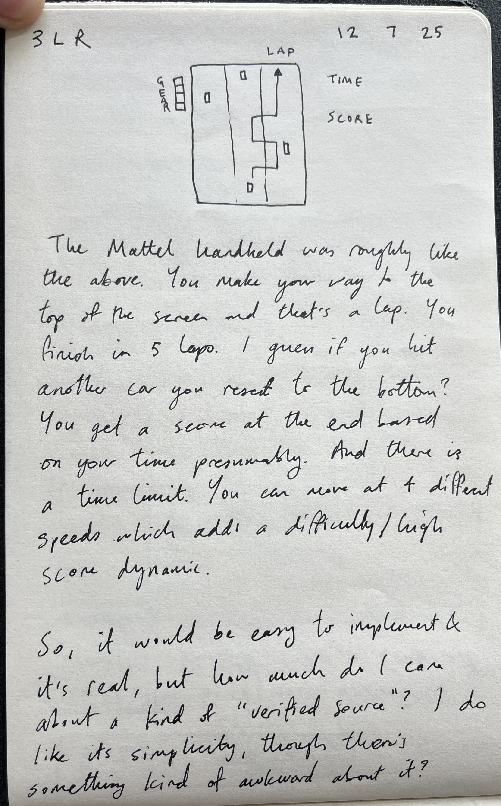

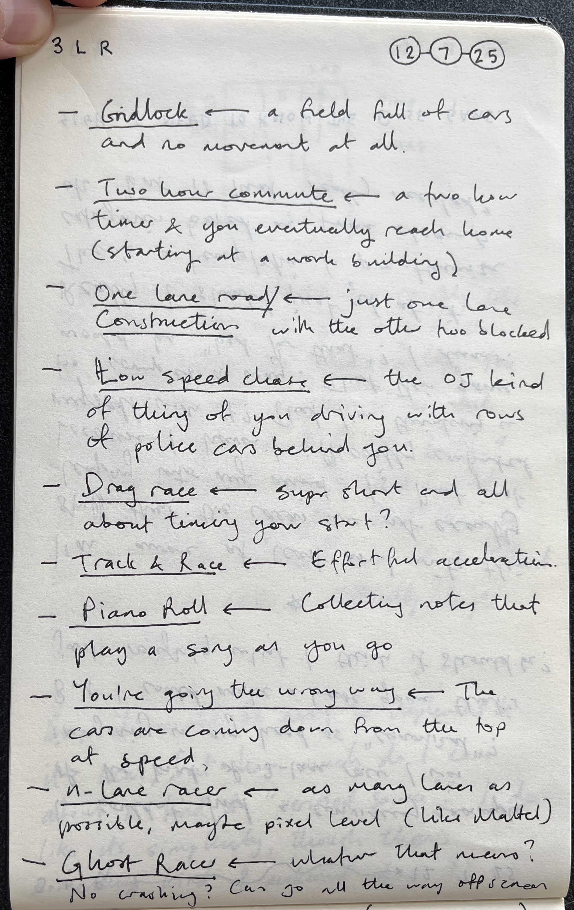

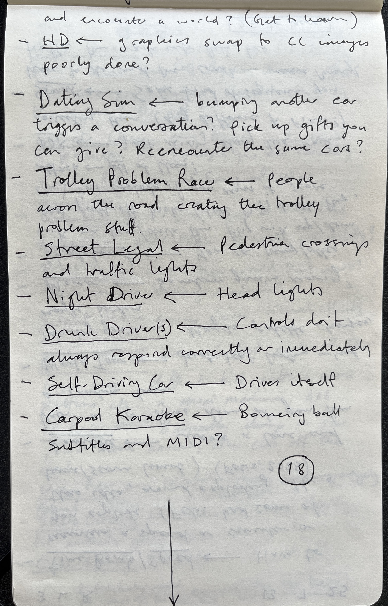

## 2025-07-13

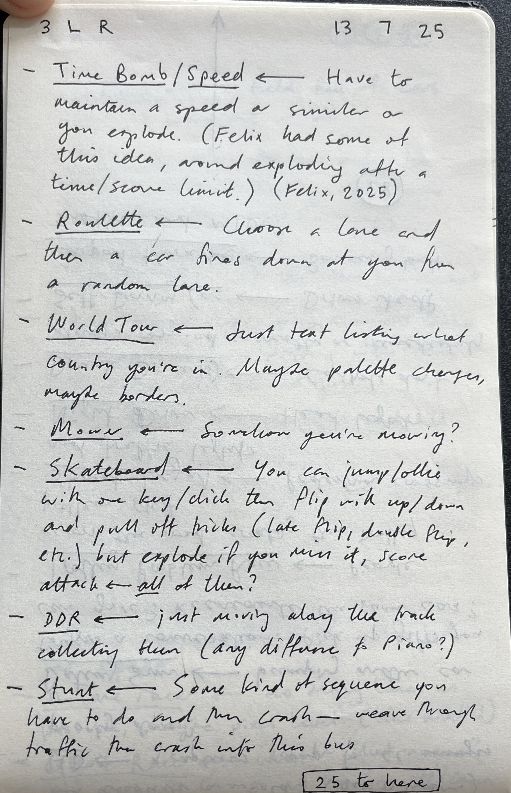

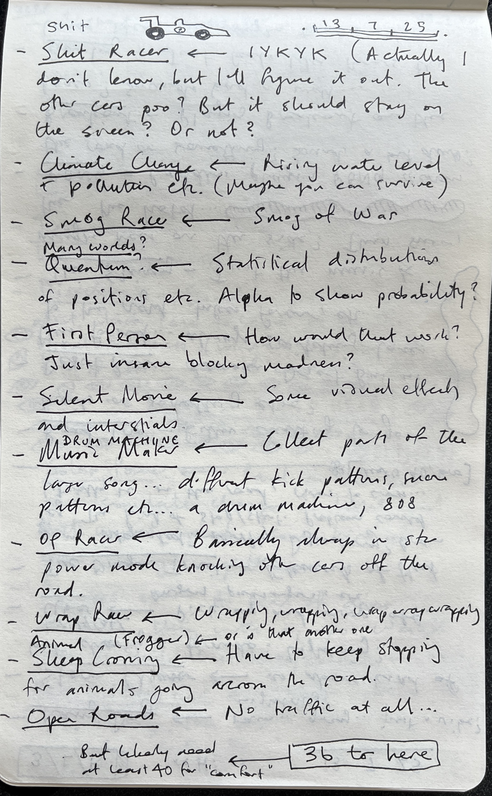

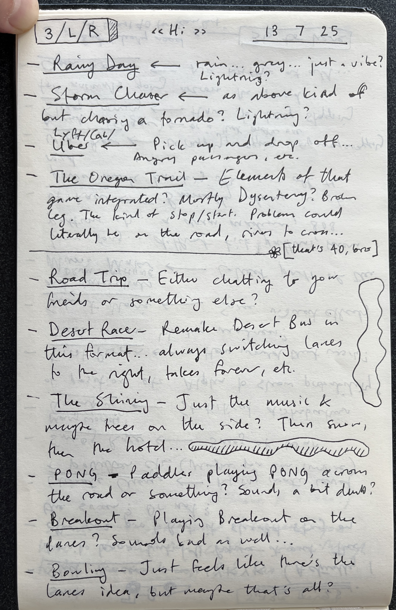

## 2025-07-15

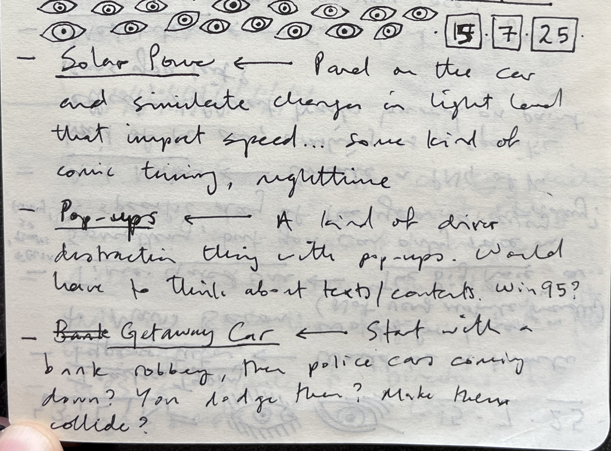

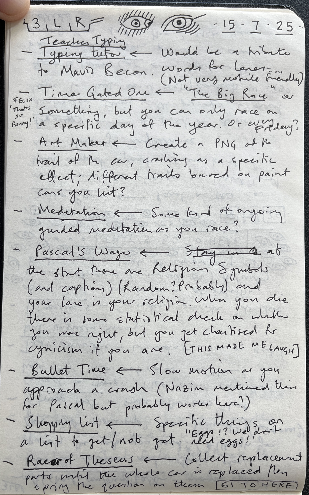

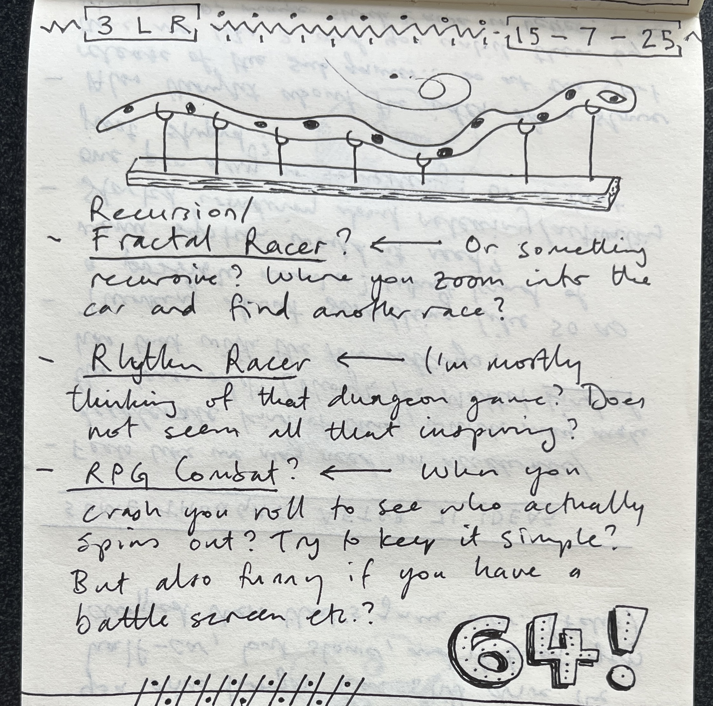

## 2025-07-16

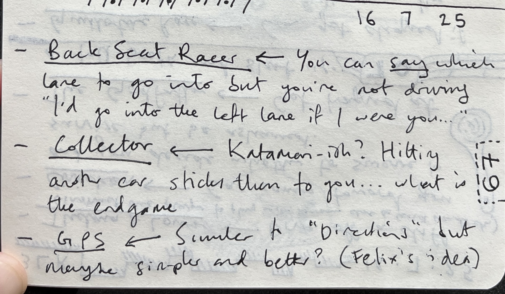

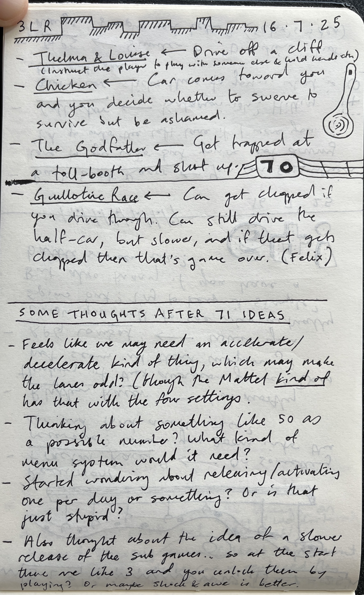

## Spinning up the racing wheels (2025-07-21)

I'm back in Montréal after a pretty extensive vacation (though some of the vacation was at DiGRA so not totally vacation). In the last 10 days we were in London at Tina and Iqbal's place and on a Saturday I found myself wanting to do some "game design". So I came up with an idea of a 1D of Let's Play: Ancient Greek Punishment (which I'll deal with elsewhere), but also the idea of a variations game based on my imagined platonic ideal of a three-lane racer game.

I ended up putting together 71 variation ideas as above, over the course of five days. A bunch of them are quite fine and I find myself hoping to put together 50 of them to actually make and release. This is all intimately connected with the fact I'm trying to write a book about variation games, so I want to be making one at the same time, and here we are.

I did go looking for an Ur-example of this kind of game and promptly couldn't find one. Strangely this Mattel racing handheld is the closest to what I sort of imagined functionally if not visually:

I also looked at some Atari games, of which *Grand Prix* and *Street Racer* had some of what I was looking for.

It remains a teeny bit unclear how I want to implement the underlying game, but I don't think any/many of the games totally rely on my knowing that ahead of time - and if anything the specifics of the implementation may well *help* in generating other ideas/niceties within the current ideas. The fact *Street Racer* has continuous movement is interesting/surprising to me as I imagined these games involving teleporting between lanes... and maybe I'll keep that in my one, I don't know. I don't think it's *that* important to have a really strong historical referent anyway.

Next tasks would be:

- Write up the variations
- Start prototyping the base case

## 2025-08-26

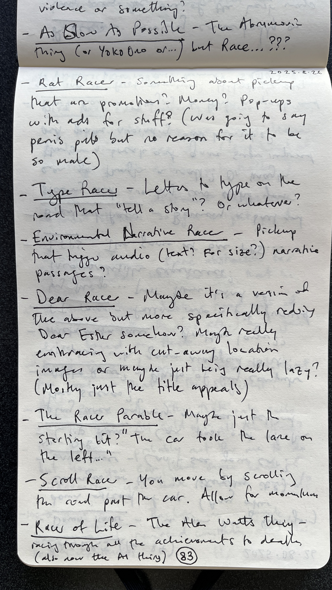

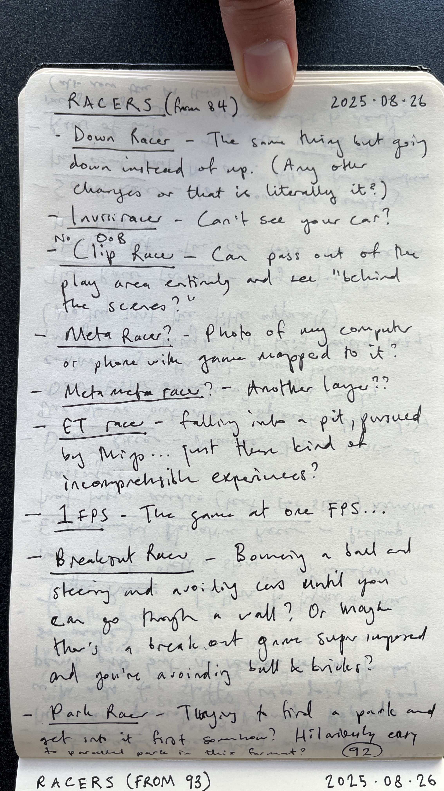

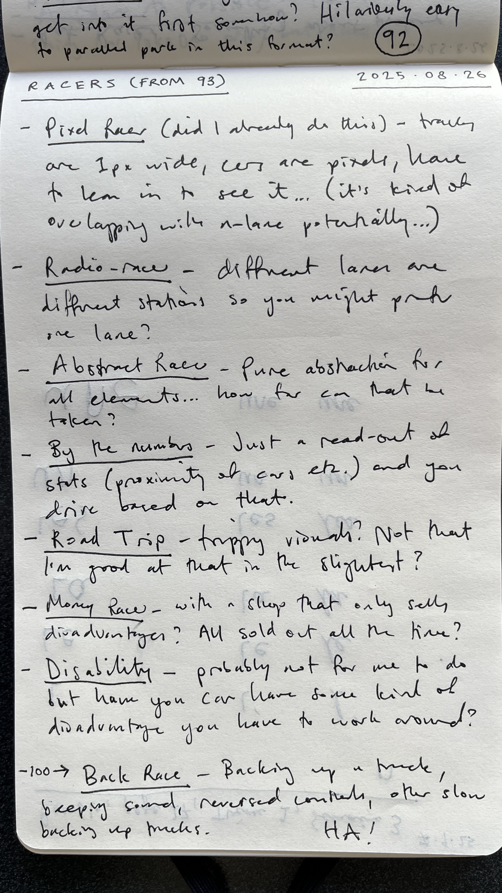

## And now, more (2025-09-08)

Time has passed, but a while ago (26th of August) I went to Noble to come up with more variations to get me to 100 and I succeeded. Only just getting these into the system now because that's the way things go sometimes bud. I fake-put them into a heading above that matches their location in time rather than when I'm adding them to the repo. Probably that makes sense.

Anyway with 100 ideas in my pocket it's definitely time to create a mega-list and start editing that down toward what I'm actually going to build. Plus the base case, yes the base case, that will decide how a lot of those ideas interact with an actual material reality of code and base-level design decisions.

## Shall we begin? (2025-10-16)

Spent a little time sitting on the bed drawing a single notebook page of thinking. it's very similar to my original sketch but I tried to engage with some of the main "technical" questions in this one in an effort to convince myself to just start.

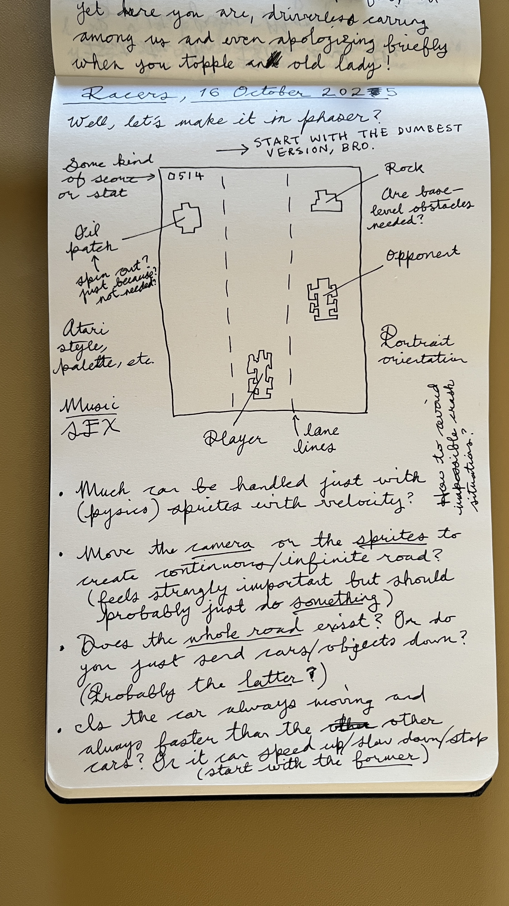

So let me... just start. I'm just going to start. I will put at least one thing on the screen.

## We have a game... (2025-10-22)

Today (and last couple of days maybe?) I've got the base game to a point where it feels like a think you actually play instead of just an idea. I think most of the juice I have got used in the commit messages, but I think I'm close to being able to say that the base game can be "locked" without much more change. I want to figure out the difficulty stuff around making the game technically possible, and any balancing around speed-up, but I think that really the basics of the whole things are there now? I don't want to over complicated it, and I've tried to mostly write it in a modular enough way that expansions/changes "should" be easy? Actually I should break more stuff down into functions because that's often where the interventions need to happen.

May not even be the worst idea to cast an eye over the variations with this implementation in mind to see if there are implementation details that would *support* variations? That could be one of the kind of research outcomes here?

## Just for fun (2025-11-02)

Been spending most of my time in the [variations](./variations.md) document lately as once I had the base implementation in place it was fun to just start making/prototyping a few of the lower hanging fruits.

As I did so, and I think I've noted this in various places, I kept coming back to this question about fun. Specifically I've been asking myself (particularly in the context of the variation game book) about the iteration process and what I'm going for in these games. And even more in particular:

- An almost linear version where I'm just trying to get the basic concept up and running so that a player could "get it" (sort of an MVP version)
- A version where I get the "get it moment" but then spend the time to double down and emphasize that concept throughout the gameplay (not just enough to get it but a sort of unified effort throughout all elements of the game) (I kind of feel like this is the normal approach for me?)
- A version where I get the "get it moment" but then turn that back on itself in terms of the spirit of the original game?

With that last one in particular I've been struck by a vaguely "moral" sense that I should try harder to make games fun or to preserve their fun in the face of my conceptual stuff. I think mostly because I'm writing this book and want to be able to appeal to a broader group of people who may not be terrible excited about conceptual work; but also from reading texts like Sharp and Macklin's *Iterate* where there's a concerted emphasis on the point of a game being its fun-ness.

So that, for example, with the Animal Crossing variation, I got some animals to go across the screen and have the player stop automatically for them, and then move on etc. But you get additional questions if you start wondering especially about entertainment value. Especially the question of racing against other cars -- the easiest thing would be to eliminate the other cars so I don't have to deal with the complexities of their "AI" dealing with the animals. 

But really to preserve the fun element you need to think about *racing* in this new context, and so various thoughts have flitted through my mind

- Most basically the idea that in between animal crossings you're racing against the others and trying to overtake etc
- But then you get into questions around, well, if it's a game of skill then shouldn't you also have to consciously *stop* for the animals yourself, and lose if you hit them?
- Followed by, what if hitting the is a penalty but not a loss and so you could take calculated risks, etc...

And a general question: many of the modes have no *endpoint* which can be dissatisfying - there's no narrative/dramatic structure to enjoy, only eventual death. So I did find myself wondering about things like multiple endings and surfacing that idea in the interface so players might want to "collect" them. Which would play into the idea of the "cinematics" I've been imagining. You could achieve different endings.

The most obvious way to have an ending is to have a finish line.

Another key floating concept is the idea of variable speed.

That latter introduces some pretty major complications, but also brings with it affordances. Hard to say.

Oh and we need honking.

Anyway, this is partly an actual meditation on "what should I do?" but also a kind of meta question about variations and about my own design process. I don't have an answer. I'll probably just keep making variations for a bit and see if my subconscious tries to help me out at all.

## Not as fun (2025-11-11)

Hmmm, energy levels on the project are a bit low at the moment, though I've now got 9 variations in various states of disrepair. The music in The Shining gave me a smile earlier today, but it's a grind for now.

Definitely running into some "expressive capacity" issues with the game I think. (Actually, seeing "honking" above was kind of huge because I feel like that's an oddly powerful idea. Gets into the realms of juice.) I wonder if it's a limitation of the game for real or just a mood thing because life outside game design and development is really hard.

It could be worth building a document about the affordances of the game and sort of seeing where or why I'm getting stuck? There are maybe too many "you can't do anything hahaha" ones that sprang to mind. Though maybe some of the juicier stuff is just later? But it feels like there are just "genres" of variation in a way I don't recall from other projects... and I think that's worth exploring and thinking through more deeply.

So that's a task: list affordances, thinking about meanings, also just interrogate the kinds of patterns I see myself slipping into. Variations as self-help.

Also just need to write up the rest of the variations in the notebook to land on some more fun stuff that I can look to implement.