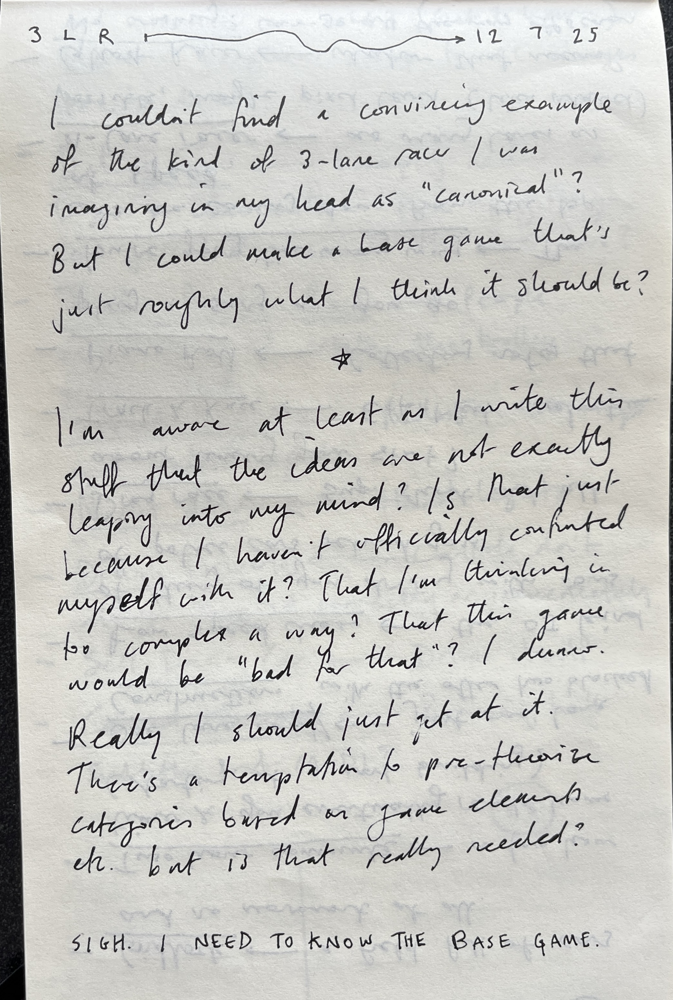
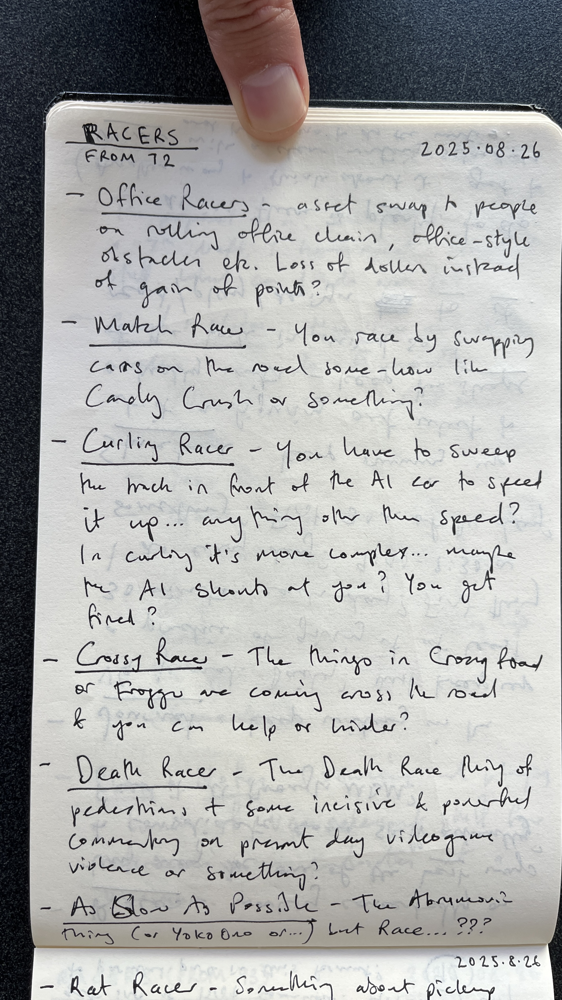

# Journal

## 2025-07-12

## 2025-07-13

## 2025-07-15

## 2025-07-16

## Spinning up the racing wheels (2025-07-21)

I'm back in Montréal after a pretty extensive vacation (though some of the vacation was at DiGRA so not totally vacation). In the last 10 days we were in London at Tina and Iqbal's place and on a Saturday I found myself wanting to do some "game design". So I came up with an idea of a 1D of Let's Play: Ancient Greek Punishment (which I'll deal with elsewhere), but also the idea of a variations game based on my imagined platonic ideal of a three-lane racer game.

I ended up putting together 71 variation ideas as above, over the course of five days. A bunch of them are quite fine and I find myself hoping to put together 50 of them to actually make and release. This is all intimately connected with the fact I'm trying to write a book about variation games, so I want to be making one at the same time, and here we are.

I did go looking for an Ur-example of this kind of game and promptly couldn't find one. Strangely this Mattel racing handheld is the closest to what I sort of imagined functionally if not visually:

I also looked at some Atari games, of which *Grand Prix* and *Street Racer* had some of what I was looking for.

It remains a teeny bit unclear how I want to implement the underlying game, but I don't think any/many of the games totally rely on my knowing that ahead of time - and if anything the specifics of the implementation may well *help* in generating other ideas/niceties within the current ideas. The fact *Street Racer* has continuous movement is interesting/surprising to me as I imagined these games involving teleporting between lanes... and maybe I'll keep that in my one, I don't know. I don't think it's *that* important to have a really strong historical referent anyway.

Next tasks would be:

- Write up the variations
- Start prototyping the base case

## 2025-08-26

## And now, more (2025-09-08)

Time has passed, but a while ago (26th of August) I went to Noble to come up with more variations to get me to 100 and I succeeded. Only just getting these into the system now because that's the way things go sometimes bud. I fake-put them into a heading above that matches their location in time rather than when I'm adding them to the repo. Probably that makes sense.

Anyway with 100 ideas in my pocket it's definitely time to create a mega-list and start editing that down toward what I'm actually going to build. Plus the base case, yes the base case, that will decide how a lot of those ideas interact with an actual material reality of code and base-level design decisions.

## Shall we begin? (2025-10-16)

Spent a little time sitting on the bed drawing a single notebook page of thinking. it's very similar to my original sketch but I tried to engage with some of the main "technical" questions in this one in an effort to convince myself to just start.

So let me... just start. I'm just going to start. I will put at least one thing on the screen.

## We have a game... (2025-10-22)

Today (and last couple of days maybe?) I've got the base game to a point where it feels like a think you actually play instead of just an idea. I think most of the juice I have got used in the commit messages, but I think I'm close to being able to say that the base game can be "locked" without much more change. I want to figure out the difficulty stuff around making the game technically possible, and any balancing around speed-up, but I think that really the basics of the whole things are there now? I don't want to over complicated it, and I've tried to mostly write it in a modular enough way that expansions/changes "should" be easy? Actually I should break more stuff down into functions because that's often where the interventions need to happen.

May not even be the worst idea to cast an eye over the variations with this implementation in mind to see if there are implementation details that would *support* variations? That could be one of the kind of research outcomes here?